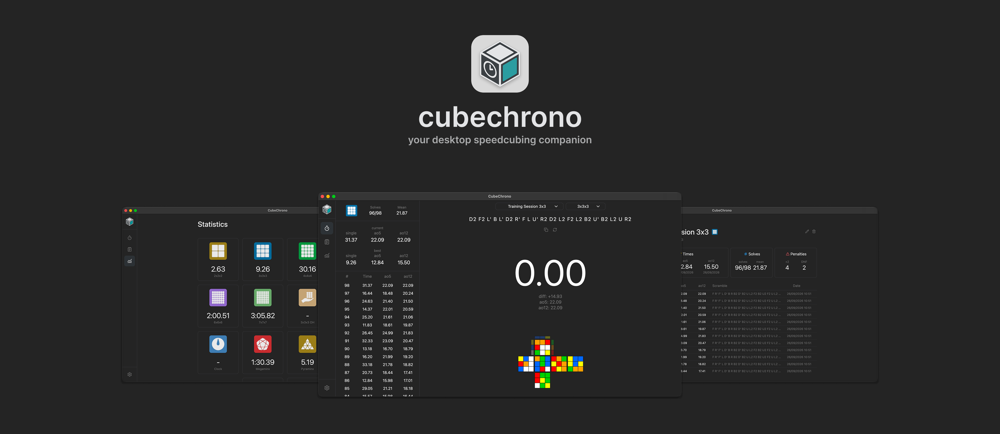
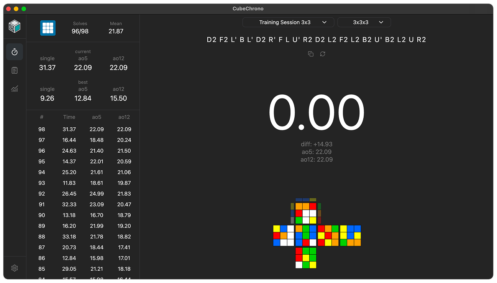
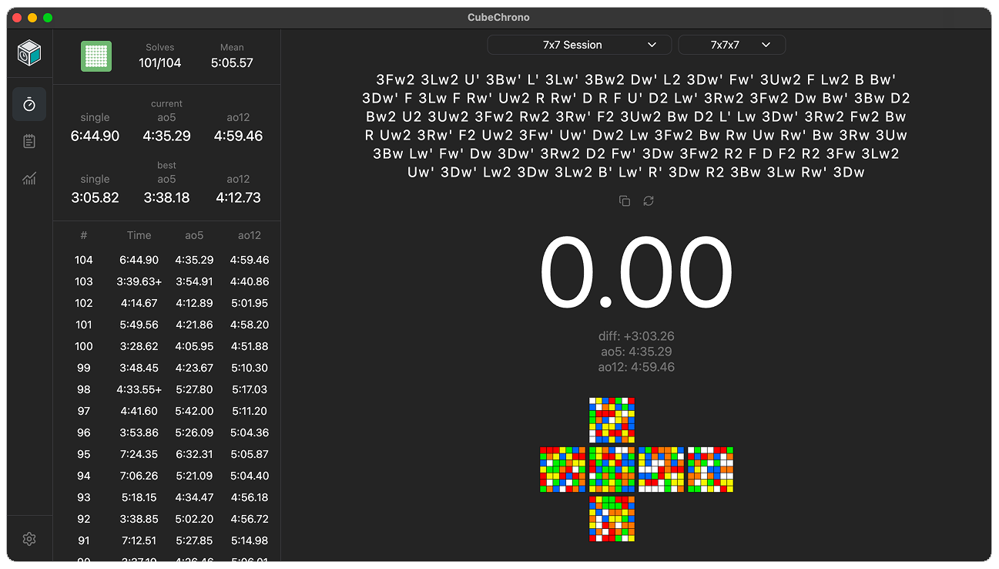
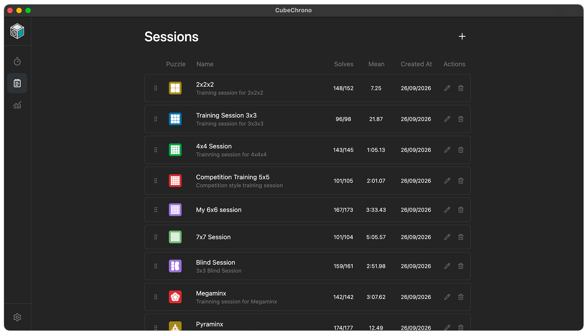
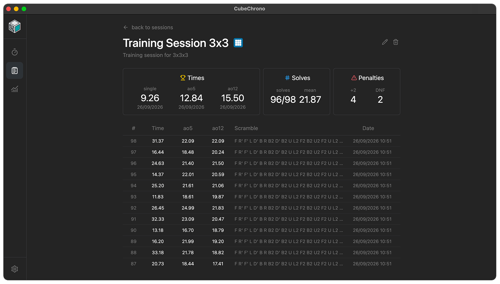
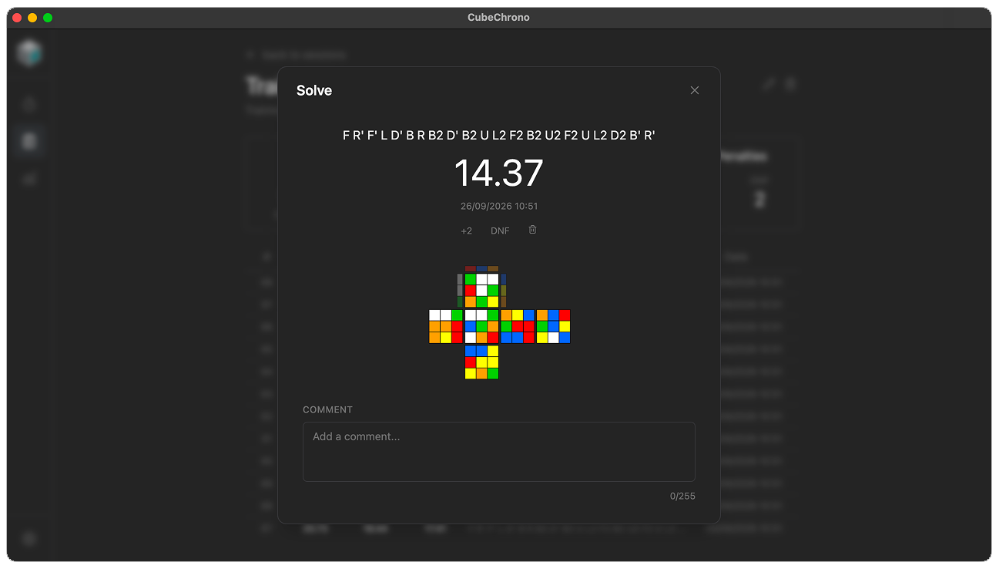
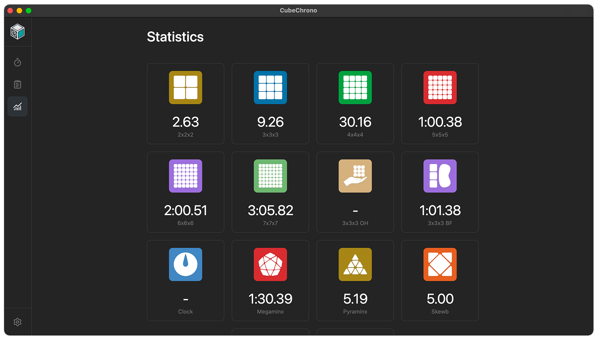
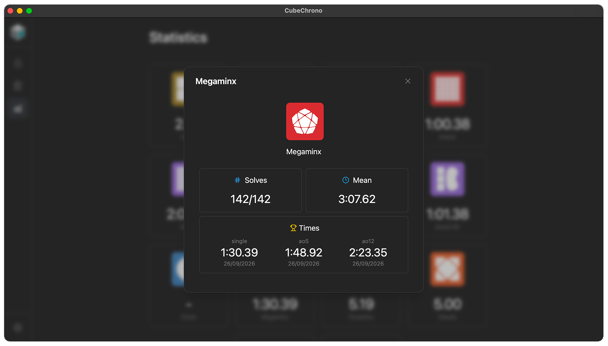

# CubeChrono

<p align="center">
  
</p>
<p align="center">
  A desktop speedcubing timer built for cubers who want a clean, fast and local-first way to track their solves.
</p>

<p align="center">
  <a href="#features">Features</a> •
  <a href="#screenshots">Screenshots</a> •
  <a href="#tech-stack">Tech Stack</a> •
  <a href="#development">Development</a> •
  <a href="#building">Building</a> •
  <a href="#roadmap">Roadmap</a> •
  <a href="#license">License</a>
</p>

---

## About

**CubeChrono** is a desktop speedcubing timer for tracking solves, sessions and statistics across WCA puzzles.

The goal is to provide a focused alternative to browser-based timers while keeping the application fast, offline-friendly and easy to use.

CubeChrono runs as a native desktop application using Electron, with a React-based interface and a local SQLite database for persistent solve data.

## Features

- ⏱️ Speedcubing timer
- 📊 Session statistics and solve history
- 🧩 Support for multiple WCA puzzles
- 📈 Detailed solve statistics
- 💾 Local data persistence
- ⚡ Built with React and Vite
- 🖥️ Windows and macOS desktop app

## Screenshots

### Timer



### Session management




### Session statistics




---

## Tech Stack

_CubeChrono_ is built with a desktop/web technology stack:

| Technology | Purpose |
| --- | --- |
| [Electron](https://www.electronjs.org/) | Desktop application runtime |
| [React](https://react.dev/) | User interface |
| [TypeScript](https://www.typescriptlang.org/) | Application language |
| [Vite](https://vite.dev/) | Development server and build tooling |
| [Tailwind CSS](https://tailwindcss.com/) | UI styling |
| [cubing.js](https://github.com/cubing/cubing.js) | Scramble generation and puzzle visualization |
| [better-sqlite3](https://github.com/WiseLibs/better-sqlite3) | Local SQLite database |
| [Zod](https://zod.dev/) | Runtime validation |
| [Vitest](https://vitest.dev/) | Testing |

## Development

Clone the repository and install dependencies:
```bash
git clone https://github.com/luis-gouveia/cubechrono.git
cd cubechrono
npm install
```

Start the development application:
```bash
npm run dev
```

### Testing

Run the test suite:
```bash
npm test
```
Run tests with coverage:
```bash
npm run test:coverage
```

## Building

_CubeChrono_ can currently be built for Windows and macOS.

### Windows

The Windows build targets x64 and produces an NSIS installer.\
Build the Windows installer:
```bash
npm run build:win
```
The installer will be generated in: `release/`

### macOS

The macOS build produces both `.dmg` and `.zip` for `Apple Silicon (arm64)` and `Intel (x64)`.\
Build the macOS application:
```bash
npm run build:mac
```
Build artifacts are generated in: `release/`

## Roadmap

_CubeChrono_ is actively being developed. Planned improvements include:
- Timer
   - Stackmat timer support
   - More timer customization options
- Import & Export
   - Import/Export solves and sessions from _CubeChrono_
   - Import solves and sessions from [csTimer](https://cstimer.net/)
- Statistics
   - More detailed session statistics
   - Additional statistics and charts

## License
This project is licensed under the MIT License - see the [LICENSE](LICENSE) file for details.